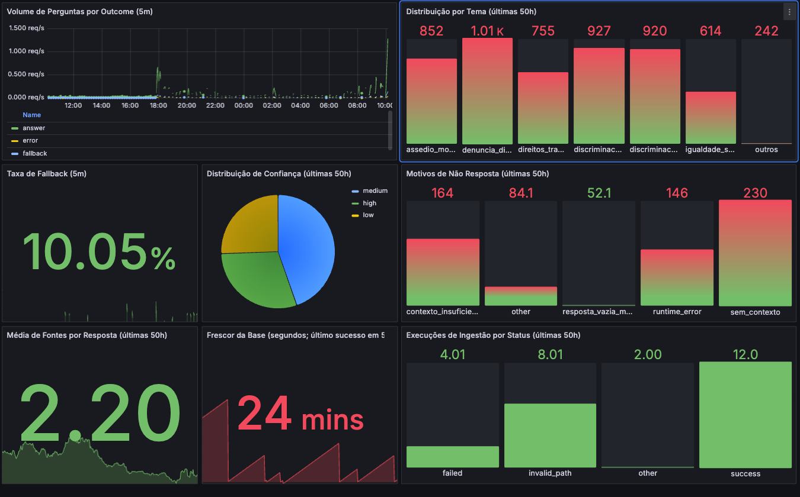

# Relatorio Tecnico - Projeto Social VozJusta

## Identificacao
- **Nome:** [Preencher nome completo]
- **Matricula:** [Preencher matricula]
- **Curso:** [Preencher curso]
- **Disciplina/Programa:** [Preencher disciplina, programa ou eixo de formacao]
- **Periodo letivo:** [Preencher periodo]

## Dados da Atividade
- **Titulo da atividade:** Desenvolvimento do VozJusta - RAG juridico de orientacao comunitaria
- **Categoria:** Participacao em projetos sociais ou atividades comunitarias com desenvolvimento de competencias correlatas ao programa
- **Carga horaria total solicitada:** **50 horas**
- **Periodo de realizacao:** 09/03/2026 (10h00) a 11/03/2026 (12h00) - total de 50 horas
- **Local/ambiente:** Projeto de software com atendimento informativo em direitos trabalhistas e discriminacao no trabalho

## Relatorio
O projeto VozJusta foi desenvolvido com foco em impacto social, visando ampliar o acesso da populacao a orientacoes iniciais sobre assedio moral, discriminacao racial, discriminacao de genero, igualdade salarial, direitos trabalhistas e canais de denuncia. A proposta central foi construir uma aplicacao local de baixo custo operacional, capaz de responder em portugues com base em fontes oficiais e com mecanismos de seguranca para reduzir riscos de desinformacao.

Durante a execucao, participei da estruturacao tecnica do monorepo, da implementacao da API com fluxo RAG, da ingestao da base juridica curada e da configuracao de observabilidade com indicadores de negocio. O trabalho incluiu definicao de contratos de API, ajuste de variaveis de ambiente, automatizacao de inicializacao e validacao por testes. Tambem foi implementado monitoramento com Prometheus e Grafana para acompanhar volume de perguntas, temas, nivel de confianca, fallback e atualizacao da base de conhecimento.

Do ponto de vista comunitario, o projeto contribui para democratizar informacoes sobre direitos em contexto de vulnerabilidade, reduzindo barreiras iniciais de entendimento juridico. O sistema nao substitui orientacao profissional, mas apoia a tomada de decisao informada e encaminha o usuario para canais oficiais quando necessario.

## Relacao Entre Atividade e Competencias Desenvolvidas
A atividade se relaciona diretamente com competencias academicas e profissionais do programa por integrar tecnologia, etica e impacto social:

1. **Analise de problemas sociais reais:** levantamento de dores ligadas a discriminacao no ambiente de trabalho e traducao dessas dores em requisitos de produto.
2. **Desenvolvimento de solucao digital com impacto comunitario:** construcao de sistema de orientacao juridica inicial com foco em acessibilidade, clareza e utilidade publica.
3. **Responsabilidade etica no uso de IA:** aplicacao de guardrails, uso de fontes oficiais, controle de confianca e disclaimers para evitar respostas inadequadas.
4. **Comunicacao tecnica e documentacao:** elaboracao de README, contratos de API, estrutura de operacao e documentacao de uso para facilitar manutencao e reproducibilidade.
5. **Monitoramento de efetividade:** implementacao de metricas de negocio (tema, fallback, confianca, cobertura de fontes e frescor da base) para avaliar funcionamento real da solucao.

## Quadro de Distribuicao de Horas (50h)
| Eixo | Atividade detalhada | Entrega/resultado | Horas |
|---|---|---|---:|
| Planejamento social | Diagnostico do problema comunitario e definicao do escopo de orientacao juridica inicial | Mapa de temas prioritarios e objetivos do projeto | 3h |
| Planejamento social | Levantamento e selecao de fontes oficiais (leis, cartilhas e referencias institucionais) | Lista curada de fontes juridicas confiaveis | 3h |
| Curadoria da base | Estruturacao de documentos da base (`.md`) e manifests com metadados oficiais | Base juridica organizada para ingestao | 3h |
| Nucleo RAG | Implementacao do pipeline de ingestao (limpeza, chunking e embeddings) | Fluxo funcional de indexacao para consulta vetorial | 6h |
| Nucleo RAG | Definicao de regras de guardrails, fallback e confianca para respostas responsaveis | Politica de resposta segura e controlada | 4h |
| Persistencia e dados | Modelagem de tabelas e migracoes (sources, documents, chunks, ingestion_runs) | Banco preparado para operacao do RAG | 4h |
| API e integracao | Implementacao dos endpoints (`/ask`, `/sources`, `/health`, `/admin/ingest/run`) e contratos | API funcional com interface publica e administrativa | 6h |
| API e operacao | Ajuste de configuracoes operacionais (`.env`, token admin, inicializacao local) | Ambiente executavel de forma reproduzivel | 2h |
| Frontend web e UX | Estruturacao da SPA publica, componentes de chat, acessibilidade basica e fluxo de uso | Interface web funcional para consulta juridica inicial | 5h |
| Frontend web e UX | Integracao da SPA com a API (`/api/v1/ask`), tratamento de estados (loading/erro) e ajuste de timeout | Experiencia de uso mais fluida e resiliente para a comunidade | 4h |
| Qualidade e validacao | Escrita e execucao de testes (unitarios, integracao, contratos e seguranca) | Evidencias de comportamento esperado e estabilidade | 6h |
| Observabilidade | Instrumentacao de metricas de negocio e tecnicas no endpoint `/metrics` | Visibilidade de uso, confianca, fallback e ingestao | 2h |
| Observabilidade | Provisionamento de Prometheus/Grafana e validacao de dashboard de negocio | Painel operacional com series reais de funcionamento | 1h |
| Documentacao final | Consolidacao de README, guias de execucao e relatorio para horas complementares | Documentacao tecnica e academica para submissao | 1h |
| **Total** |  |  | **50h** |

## Resultados e Impacto Comunitario Esperado
- Disponibilizacao de orientacao inicial sobre direitos trabalhistas e discriminacao com base em fontes oficiais.
- Aumento da capacidade de triagem informativa para pessoas que nao sabem por onde comecar.
- Incentivo ao encaminhamento para canais institucionais adequados em casos de baixa confianca ou risco.
- Base tecnica replicavel para extensao comunitaria e evolucoes futuras do projeto.

## Evidencias (Preencher Antes do Envio)
- **Repositorio do projeto:** https://github.com/dev-rodrigues/vozjusta
- **Pull Request principal:** https://github.com/dev-rodrigues/vozjusta/pull/1
- **Capturas do dashboard Grafana:** [img.png](img.png)
- **Gravacao de tela (demo):** [Gravação de Tela 2026-03-11 às 15.32.37.mov](<Gravação de Tela 2026-03-11 às 15.32.37.mov>)

### Visualizacao no GitHub

